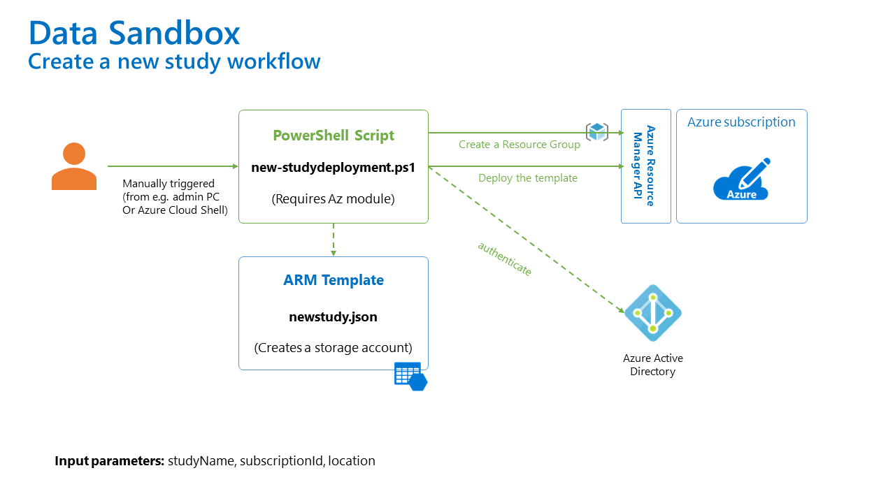

# Create a new study workflow

This workflow will create a new study in Azure.

This is how it works:

- An administrator (who has necessary permissions to create a study, i.e. Owner role on the subscription level) will execute a `new-studydeployment.ps1` script from their PC (or Azure Cloud Shell)
- Mandatory input parameters are: `studyName`, `subscriptionId`, and `location`
- After authenticating against Azure AD, the script will create a new Resource Group and deploy a template (`newstudy.json`) that will provision a storage account (that will be shared among studies)
