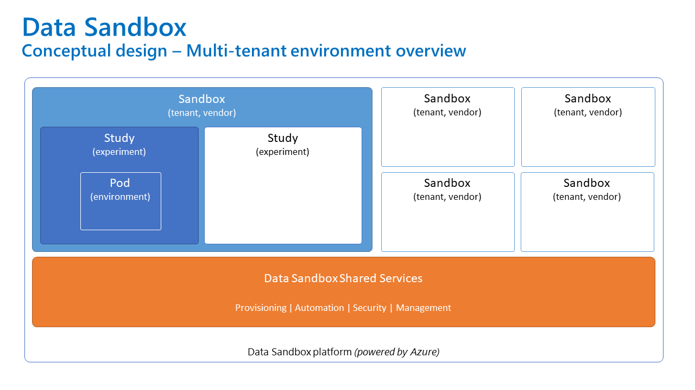

# Environment Overview

The entire Data Sandbox platform can be be logically divided into two parts:

- **Data Sandbox Shared Services** - hosting components for provisioning, automation, security, and management of the entire platform and all its tenants
- **Sandboxes aka tenants (vendors)** - each sandbox is isolated from each other and can contain multiple **studies** (experiments). Studies can comprise multiple **pods**.

It is possible to either have both parts in the same Azure subscription or have the Shared Services part in a separate one.