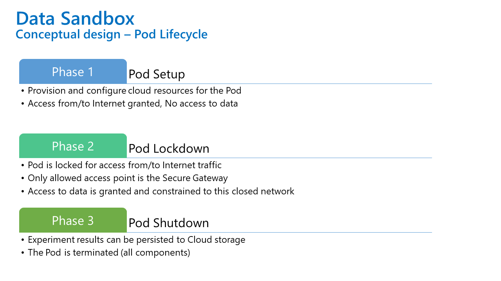
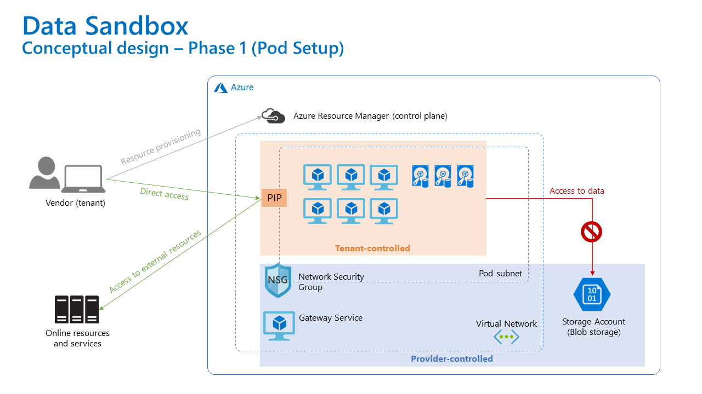
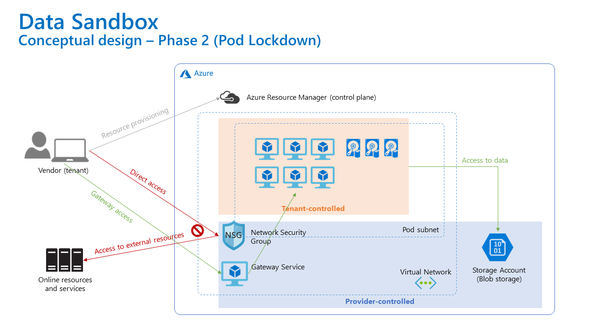
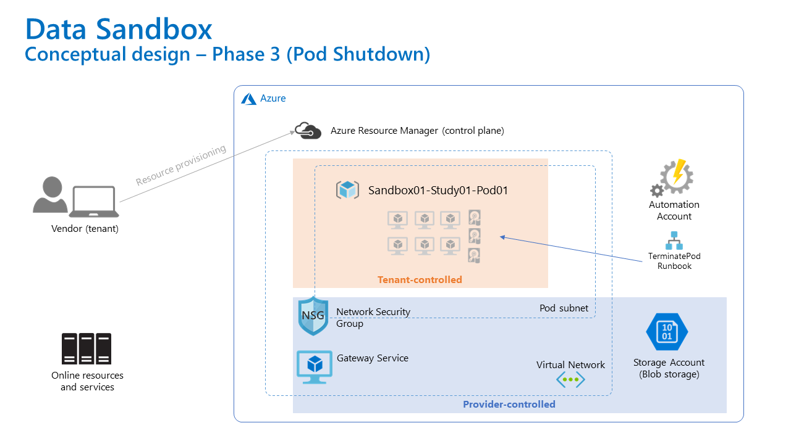

# Pod Lifecycle Overview

## Overview

The lifecycle of a pod represents a key principle that will ensure required security and compliance level.

It has three phases that always run in the exact order (from phase 1 to 2 and 3). The order shall not be reversed!

## Phase 1 - Pod Setup

In this phase, a tenant is given an access to provision and configure needed infrastructure _(initially, only Azure VMs, Managed Disks, NICs, Public IPs are supported)_ as well as deploy (install) required software on top to be able to run experiments inside the pod.

Tenant can access the Pod and its resources directly from the Internet (e.g. via ssh or RDP) and virtual machines in the pod can communicate to the Internet without any restrictions.

Access to data is not possible at this stage, since it is possible to "leak" data out of the pod.

## Phase 2 - Pod Lockdown

The second phase gives tenants the possibility to access provider's data but only after the network has been locked down:

- no direct access is possible anymore, the only way to the Pod is via **Secure Gateway**
- no access to external network is possible, every attempt is blocked on the firewall

## Phase 3 - Pod Shutdown

When the work is completed (partly or fully), the results can be stored to a designated area in the cloud storage. If a tenant needs additional resources or software to continue the work, the only way to continue is to discart the pod environment and switch to **Phase 1** again.

_Note: We are considering a possibility to allow tenant to create a **snapshot** of the environment in Phase 1, so they won't need to start from scratch, they would just add extra components and software after restoring this snapshot._