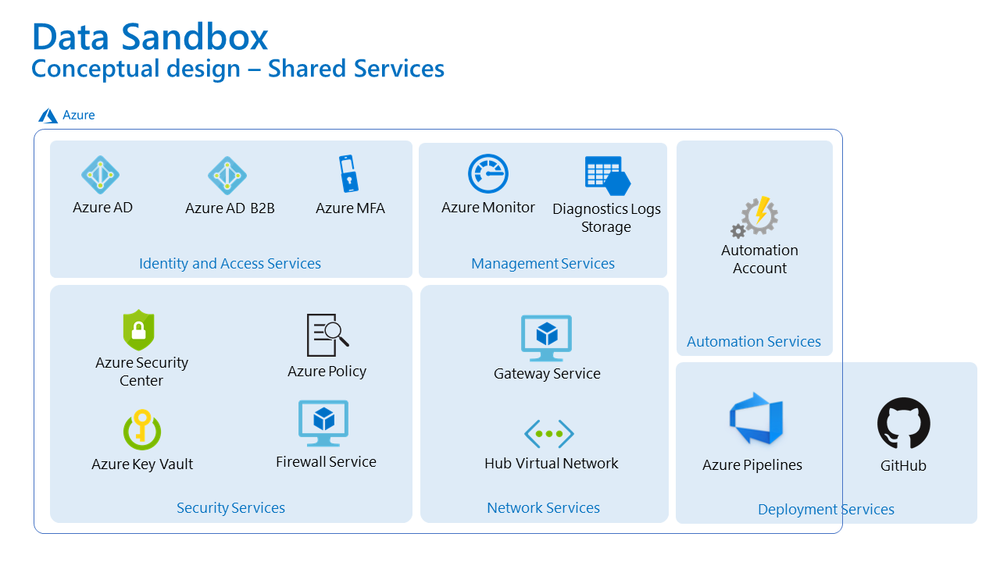

# Shared Services Overview

The ambition is to achieve the highest possible level of automation and self-service. This requires a number of components and services to be provisioned, configured, and used in the environment.

## Identity and Access Services

- Azure Active Directory as IdP is a key element for authentication and authorization
- Azure AD B2B Collaboration can be used to "onboard" identities from other AAD tenants as guests. This is an alternative to creating a regular account in the tenant
- Azure MFA (Multi-Factor Authentication) can be used to enforce strong authentication to Azure for tenants

## Security Services

- Firewall Service - technology for this to be defined _(we are considering: NSGs, Azure Firewall, NVAs e.g. Palo Alto)_
- Azure Policy - will ensure that only "whitelisted" Azure resource types can be provisioned.
- Azure Key Vault - secrets and certificates store
- Azure Security Center - a central place to check the environment against security best practices and detect potential threats and breaches

## Network Services

- Gateway Service - technology for this to be defined _(it should act as a "bastion host" or terminal server)_
- Hub Virtual Network - depending on the design (centralized vs. decentralized Gateway Service and/or Firewall Service), there could be either one Hub VNet with these central components or there won't be such hub, and these two services will have their own instance in each Pod

## Deployment Services

- GitHub - all source code for this solution (including infrastructure and configuration) will be stored on GitHub
- Azure Pipelines - will be used for enabling CI/CD pipelines to automate builds and releases.

## Automation Services

- Azure Automation - there will be an automation account with runbooks responsible to automate all (or majority) operational tasks

## Management Services

- Azure Monitor - centralized monitoring and logging with analytics for platform and apps running as part of this platform
- Diagnostics Logs Storage Account - central archive of logs for longer retention period

